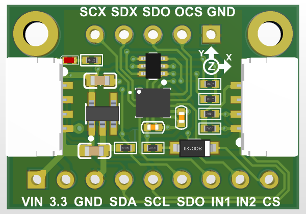

# LSM6DSOX/LSM6DSO测试

* [English version](./README.md)

> LSM6DSOX 传感器模块



## 1 - 模块介绍

  见证 ST 的最新 6 轴 IMU 传感器：LSM6DSOX/LSM6DSOW。  
  该 IMU 传感器提供 6 自由度（3 轴线性加速度 + 3 轴角速度），不同量程和更新速率范围。  
  加速度计：±2/±4/±8/±16 g，更新频率 1.6 Hz~6.7 kHz。  
  陀螺仪：±125/±250/±500/±1000/±2000 dps，更新频率 12.5 Hz~6.7 kHz。  
  还有更多内建功能，比如敲击检测、活动检测、计步器/步数统计，以及可编程有限状态机/机器学习核心(LSM6DSOX支持) ，支持基础手势识别。  
  通信支持 SPI 和 I2C 两种接口，两个中断引脚可配置。  
  进阶场景下，可挂载外部 I2C/SPI 设备，用于光学稳定等扩展功能。

## 2 - 编译和运行

### 2.1 克隆仓库

```git
git clone --recursive https://github.com/Eric-Hsia/lsm6dso_test_stm32f411c
```

#### 其他例程

参考 [STMems_Standard_C_drivers](https://github.com/STMicroelectronics/STMems_Standard_C_drivers) 仓库中的 lsm6dsox_STdC 相关例程，了解更多功能和使用方法。

### 2.2 安装 Visual Studio Code 的 STM32CubeIDE 插件

按照 [STM32CubeIDE for Visual Studio Code](https://marketplace.visualstudio.com/items?itemName=stmicroelectronics.stm32-vscode-extension) 插件市场页面的说明进行安装。

### 2.3 添加浮点打印支持(cmake)

在 STM32（ARM Cortex-M）的 newlib-nano（轻量级 C 库）中，默认情况下 snprintf 不支持浮点数格式化（%f、%4.2f 等）。

```bash
target_link_options(${PROJECT_NAME} PRIVATE
    -u _printf_float
)
```

## 3 - 参考信息

* [LSM6DSOX](https://www.st.com/en/mems-and-sensors/lsm6dsox.html)

* [LSM6DSOX device application note](https://www.st.com/resource/en/application_note/DM00571818.pdf)

* [LSM6DSOX finite state machine](https://www.st.com/resource/en/application_note/DM00572971.pdf)

* [LSM6DSOX machine learning core](https://www.st.com/resource/en/application_note/DM00563460.pdf)